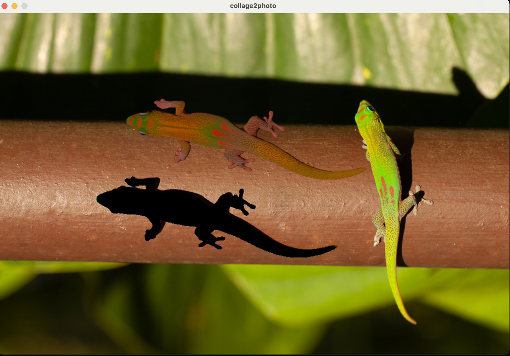

# Interactive UI for collage2photo



How-to:

- Load an image of your choice. Note that MagicFixup is designed to take square images as input
- Click to segment and an object.
- Drag the segment around to perform your edit.
- Clik the "Process..." button to run the model and produce the cleaned-up output.

We use [PDM](https://pdm-project.org/latest/) as dependency manager:

Install with:

```shell
pdm install
```

Alternatively, you can use your package manager of choice and install pyglet, opencv-python, and [segment anything](https://github.com/facebookresearch/segment-anything)

Download segment anything [checkpoint](https://dl.fbaipublicfiles.com/segment_anything/sam_vit_h_4b8939.pth) and place it under the data directory. If needed, you can use lighterweight checkpoint for faster inference.

Then run locally using:

```shell
python app.py <path to input image>
```
